# AI Voice EMR Blockchain System — Architecture & Flow

This document details the complete end-to-end architecture of the AI Voice EMR system, including data flow, component interactions, and API specifications.

## System Architecture Flow

The system operates across four primary layers: Telephony & AI (LiveKit), Backend API (Node.js), Storage (Supabase & Ganache), and Frontend (React Dashboard).

```mermaid
sequenceDiagram
    participant Patient
    participant LiveKit as LiveKit Cloud Agent
    participant Webhook as Cloudflare Tunnel
    participant Backend as Node.js Express API
    participant DB as Supabase (PostgreSQL)
    participant BC as Ganache Blockchain
    participant Doctor as Doctor Dashboard (React)

    %% 1. Voice Interaction
    rect rgb(23, 32, 42)
    Note over Patient, LiveKit: Phase 1: AI Data Collection
    Patient->>LiveKit: Calls Clinic Number (+1 484...)
    LiveKit-->>Patient: Greetings, requests symptoms
    Patient->>LiveKit: Explains symptoms, duration, history
    LiveKit->>LiveKit: Inquires about preferred appointment times
    Patient->>LiveKit: Provides appointment preferences
    LiveKit->>LiveKit: LLM generates structured EMR (JSON) include appointments
    LiveKit-->>Patient: Doctor will review shortly (Call ends)
    end

    %% 2. Webhook & Parsing
    rect rgb(20, 40, 60)
    Note over LiveKit, Backend: Phase 2: Webhook Delivery
    LiveKit->>Webhook: POST /api/emr-summary (JSON Payload)
    Webhook->>Backend: Forwards Request to Port 5001
    Backend->>Backend: Parses Patient Name, Age, Symptoms, Appointment Data
    Backend->>DB: INSERT INTO emr_records (Status: Pending)
    DB-->>Backend: Returns new record_id
    Backend-->>LiveKit: 200 OK
    end

    %% 3. Doctor Review & Approval
    rect rgb(15, 50, 40)
    Note over Doctor, DB: Phase 3: Dashboard Review
    Doctor->>Backend: GET /api/emr
    Backend->>DB: Fetch all records
    DB-->>Doctor: Updates Dashboard UI
    Doctor->>Doctor: Reviews AI findings, makes edits
    Doctor->>Backend: PUT /api/emr/:id (Save Changes)
    Backend->>DB: Update record
    Doctor->>Backend: POST /api/approve-emr/:id
    end

    %% 4. Blockchain Hashing
    rect rgb(50, 25, 60)
    Note over Backend, BC: Phase 4: Blockchain Integrity Lock
    Backend->>DB: Fetch approved record JSON
    Backend->>Backend: Generate SHA-256 Hash of summary_json
    Backend->>BC: Smart Contract: storeHash(record_id, sha256_hash)
    BC-->>Backend: Returns Blockchain TX Hash
    Backend->>DB: UPDATE emr_records SET status="approved", hash, tx_hash
    Backend-->>Doctor: 200 OK (Success Toast)
    end

    %% 5. Verification
    rect rgb(60, 45, 15)
    Note over Doctor, BC: Phase 5: Zero-Trust Verification
    Doctor->>Backend: POST /api/verify-record { record_id }
    Backend->>DB: Fetch current record data
    Backend->>Backend: Recompute SHA-256 Hash
    Backend->>BC: Smart Contract: getHash(record_id)
    BC-->>Backend: Returns original SHA-256 Hash
    alt Hashes Match
        Backend-->>Doctor: { status: "VERIFIED" }
        Doctor->>Doctor: UI shows Green "Intact" Banner
    else Hashes Do Not Match
        Backend-->>Doctor: { status: "TAMPERED" }
        Doctor->>Doctor: UI shows Red "Tampered" Warning
    end
    end
```

## Component Interconnection

### 1. LiveKit to Backend
The **LiveKit Cloud Agent** acts as the tip of the spear. It runs entirely on LiveKit's infrastructure using Gemini 3 Flash for LLM extraction, Deepgram for STT, and Cartesia for TTS. 
When a call concludes, LiveKit triggers a webhook to a `trycloudflare.com` tunnel. The Cloudflare tunnel securely forwards this external traffic to `localhost:5001` where our Node.js Express server is listening.

### 2. Backend to Database (Supabase)
The backend uses `@supabase/supabase-js`. 
- **Creation**: When the webhook fires, the backend shapes the JSON array and inserts a new draft into the `emr_records` Postgres table. 
- **Retrieval**: The dashboard polls the backend every 15 seconds, which performs a `SELECT *` from Supabase to render the UI.

### 3. Backend to Blockchain (Ganache)
The backend uses `ethers.js` connected to the local Ganache RPC (`http://127.0.0.1:7545`).
When a record is approved, the backend acts as a wallet (using a private key from `.env`) to sign a transaction sending the `SHA256` hash to our deployed `EMRHashRegistry` smart contract.

### 4. Frontend to Backend
The React frontend (Vite) runs on `localhost:5173/5174` and communicates with the backend via standard REST APIs (Fetch). No direct database or blockchain connections occur on the frontend — the Node API acts as the secure intermediary for all actions.

## API Route Specifications

| Method | Endpoint | Purpose | Triggered By |
|--------|----------|---------|--------------|
| `POST` | `/api/emr-summary` | Receives raw call JSON, parses it, creates pending EMR. | LiveKit Webhook |
| `GET`  | `/api/emr` | Fetches all EMR records, ordered by creation date. | Dashboard (Auto-refresh) |
| `GET`  | `/api/appointments`| Fetches scheduled appointments. | Dashboard (Auto-refresh) |
| `GET`  | `/api/emr/:id` | Fetches a single EMR record by its ID. | Dashboard |
| `PUT`  | `/api/emr/:id` | Updates specific fields of a pending EMR. | 'Save Changes' Button |
| `POST` | `/api/approve-emr/:id` | Hashes EMR, stores on Ganache, marks as approved. | 'Approve EMR' Button |
| `POST` | `/api/verify-record` | Recomputes hash, compares with Ganache, returns status. | 'Verify Integrity' Button |
